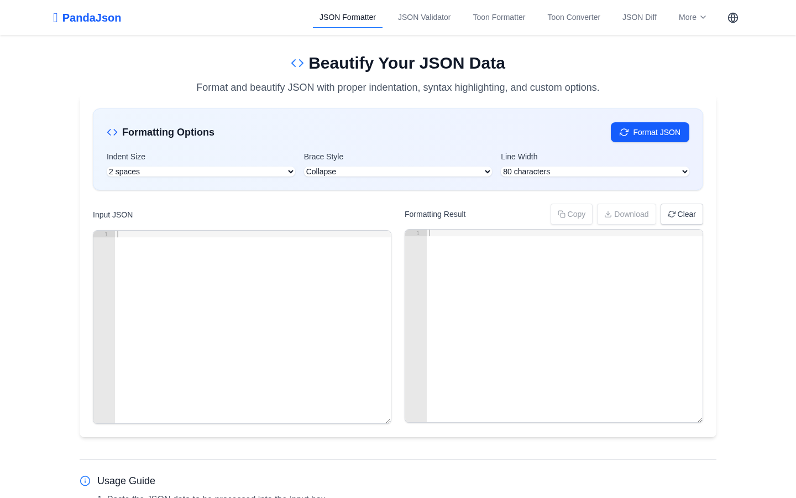
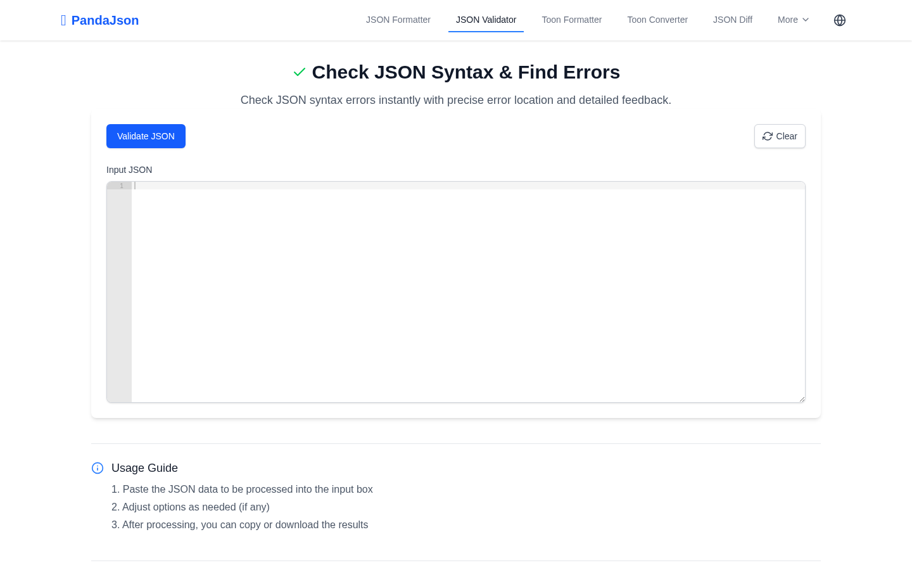
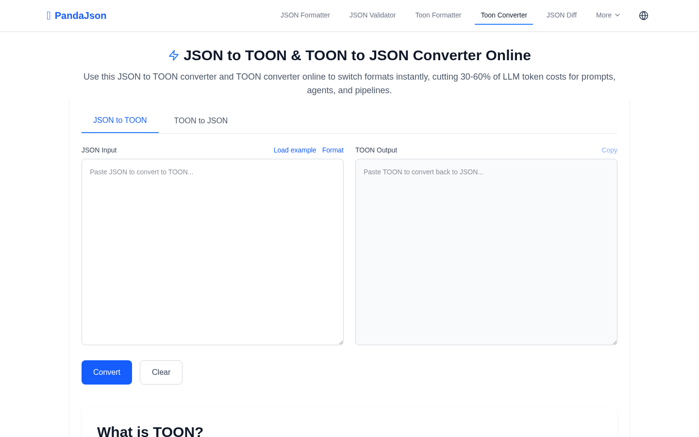

  

# JSON Panda

Official public repository for [JSON Panda JSON formatter and validator](https://jsonpanda.com). JSON Panda provides browser-based tools for formatting, validating, converting, diffing, editing, minifying, schema-checking, and TOON conversion workflows.

This repository is the public home for product feedback, issue reports, roadmap notes, support guidance, and community discussion. It does not contain the private production source code for the live website.

## Product Preview

| JSON validator | TOON converter |
| --- | --- |
|  |  |

## Product Focus

- Developers checking API responses, configs, and test payloads
- QA engineers comparing staging and production JSON output
- Data analysts converting between JSON, CSV, TSV, YAML, and XML
- AI builders preparing compact TOON data for LLM prompts and restoring it to JSON

## Main Workflows

- Beautify or minify JSON with syntax feedback and copy/download actions.
- Validate JSON and locate parsing errors by line and column.
- Convert between JSON, YAML, XML, CSV, and TSV.
- Compare JSON structures side by side and inspect added, deleted, and modified values.
- Use JSON Schema validation and TOON conversion for API and LLM-oriented data work.

## What To Open Here

- Formatting, validation, parser, or error-location issues
- Conversion mismatches across JSON, YAML, XML, CSV, TSV, or TOON
- JSON diff cases where nested changes are unclear
- Schema validation or tree editor behavior that affects real developer workflows

## Repository Boundary

- Public issues and discussions are welcome when they improve the live product experience.
- Do not post private account data, secrets, payment details, uploaded personal media, or sensitive logs.
- Production application code, provider credentials, billing configuration, and deployment secrets are not published here.
- Security reports should follow [SECURITY.md](SECURITY.md) instead of public issues.

## Product Feature Links

- [JSON Panda JSON formatter and validator](https://jsonpanda.com): Format, validate, convert, diff, edit, minify, and schema-check JSON in the browser.
- [JSON Panda JSON formatter](https://jsonpanda.com/formatter): Open the focused JSON formatting workspace.

## Recent Updates

- 2026-07: Reworked README product-entry links so anchor text matches the target page topic and current language.
- 2026-07: Separated repository, feedback, and support routes from product feature links to avoid duplicate product URLs.

## Repository Links

| Destination | Link |
| --- | --- |
| Primary GitHub repository | [JSON Panda primary GitHub repository](https://github.com/jsonpanda-com/jsonpanda) |
| Roadmap | [ROADMAP.md](ROADMAP.md) |
| Support | [SUPPORT.md](SUPPORT.md) |
| Security | [SECURITY.md](SECURITY.md) |
